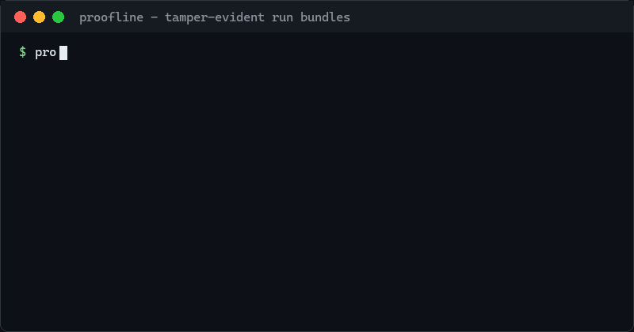

# Proofline

[](https://github.com/Powfu-zwx/proofline/actions/workflows/ci.yml)
[](https://pypi.org/project/proofline/)
[](LICENSE)
[](pyproject.toml)

Proofline is a model-agnostic protocol and reference implementation for verifiable AI runs.



A run bundle is a single JSON document that records the inputs, code revision, model/tool steps, outputs, costs, redactions, and hashes needed to replay, diff, and audit LLM or agent executions. The core is a versioned schema; SDKs, storage backends, and framework adapters are replaceable layers around it.

## Why

- **Regression testing.** `proofline diff` compares two runs semantically. Run ids, timestamps, positional step ids, and derived digests never show up as noise; what changed in inputs, outputs, and costs does. Step sequences are aligned first, so an inserted or removed step reports once instead of misaligning every step after it. See [CI regression gates](docs/ci-regression.md) for the end-to-end recipe.
- **Replay.** A bundle doubles as a test fixture: recorded responses are served back through the wrappers, so pipelines re-run deterministically, offline, and for free — and diffing a replayed run against its baseline tells you whether a change came from your code or from model drift. See [replay](docs/replay.md).
- **Audit and forensics.** A stable SHA-256 digest catches corruption and careless edits, and `proofline verify` re-checks every stored hash, redaction path, and secret pattern. [Ed25519 signatures](docs/signing.md) go further: a signed bundle cannot be altered — or re-sealed — without the signer's key.
- **Portability.** A bundle is one JSON file with a published [schema](schemas/run.schema.json) and [spec](spec/run-bundle-v0.1.md). No server, no vendor lock-in.

## Non-goals

- Not another chat UI or agent framework.
- Not a model provider or prompt registry.
- Not a claim that reruns are bit-identical when the underlying model or tools are nondeterministic.

## Install

```bash
pip install proofline
```

Provider integrations are optional extras: `pip install "proofline[openai]"` or `pip install "proofline[anthropic]"`. For development installs, see [CONTRIBUTING.md](CONTRIBUTING.md).

## Quickstart

Record the same command twice, then prove the runs are semantically identical:

```bash
proofline run --out a.run.json -- python -c "print('hello agent')"
proofline run --out b.run.json -- python -c "print('hello agent')"

proofline verify a.run.json
# OK a.run.json

proofline diff a.run.json b.run.json
# no semantic differences
```

Timestamps and run ids differ between the two bundles, but both are excluded from the stable digest and from semantic diffs, so identical work produces an empty diff. For agent-shaped runs with tool, model, and check steps, clone the repo and try `examples/code_fix_agent.py` and `examples/rag_citation_check.py`. `examples/semantic_diff_demo.py` walks the same diffs against a naive JSON comparison.

## SDK

```python
from proofline import RunRecorder

with RunRecorder(out_path="artifacts/demo.run.json") as recorder:
    with recorder.step("model", "draft", input={"prompt": "hi"}) as step:
        step["output"] = {"text": "ok"}
        step["cost"] = {"input_tokens": 3, "output_tokens": 1}
```

Secrets are redacted before anything touches disk: keys like `api_key` / `credentials` and values like `sk-...`, `AKIA...`, `Bearer ...`, or JWTs are replaced with `[REDACTED]`, and each redaction site is recorded as a JSON Pointer in the bundle.

See `examples/rag_citation_check.py` and `examples/code_fix_agent.py` for full agent-shaped runs.

## Replay

Any bundle recorded through the wrappers can answer the same pipeline again — no API key, no network, no cost:

```python
from proofline.replay import ReplaySource

client = wrap(OpenAI(), recorder, replay=ReplaySource("baseline.run.json"))
```

Or, with zero code changes, set `PROOFLINE_REPLAY=baseline.run.json` in the environment. Strict matching turns the baseline into a fixture; ordered matching lets a changed pipeline complete so the bundle diff shows exactly what your code changed. [docs/replay.md](docs/replay.md) covers strategies, streaming fidelity, and the attribution workflow.

## Crash safety

Long agent runs die halfway, and evidence held only in memory dies with them. `journal=True` appends each completed step — fsynced — to a sidecar journal the moment it finishes, and keeps step payloads on disk so memory stays bounded by the largest step, not the run length:

```python
with RunRecorder(out_path="artifacts/agent.run.json", journal=True) as recorder:
    ...
```

If the process is killed mid-run, `proofline recover artifacts/agent.run.json.journal` rebuilds and verifies the bundle from everything that reached disk; a torn final line from the crash is detected and dropped. `proofline run --journal` records subprocess runs the same way. See [docs/journal.md](docs/journal.md) for guarantees, the journal format, and recovery semantics.

## Signing

```bash
pip install "proofline[sign]"
proofline keygen --out keys/
proofline sign run.json --key keys/proofline-signing.pem
proofline verify run.json --signed-by keys/proofline-signing.pub.pem
```

The signature covers the entire document — including the fields the stable digest deliberately ignores — so editing anything and re-sealing the digest still breaks it. [docs/signing.md](docs/signing.md) covers the threat model, key handling, and keyless CI signing with Sigstore.

## Integrations

### OpenAI

```bash
python -m pip install -e ".[openai]"
```

```python
from openai import OpenAI
from proofline import RunRecorder
from proofline.openai import wrap

with RunRecorder(out_path="artifacts/openai.run.json") as recorder:
    client = wrap(OpenAI(), recorder)
    client.chat.completions.create(
        model="gpt-4o-mini",
        messages=[{"role": "user", "content": "ping"}],
    )
```

Each `chat.completions.create` call is recorded as a `model` step with the request as input, the response as output, and token usage as cost. Streaming calls are recorded too: the accumulated text is stored together with a `truncated` flag, and a failed request records an `error` step. `AsyncOpenAI` clients are wrapped by the same `wrap()` call. Run `examples/openai_chat.py` for an end-to-end recorded call.

### Anthropic

```bash
python -m pip install -e ".[anthropic]"
```

```python
from anthropic import Anthropic
from proofline import RunRecorder
from proofline.anthropic import wrap

with RunRecorder(out_path="artifacts/anthropic.run.json") as recorder:
    client = wrap(Anthropic(), recorder)
    client.messages.create(
        model="claude-sonnet-4-5",
        max_tokens=256,
        messages=[{"role": "user", "content": "ping"}],
    )
```

`messages.create` is recorded the same way, including `stream=True` event iteration, and `AsyncAnthropic` clients are wrapped by the same `wrap()` call. Run `examples/anthropic_chat.py` for an end-to-end recorded call.

### Pi coding agent

[pi-proofline](https://github.com/Powfu-zwx/pi-proofline) records every [pi](https://pi.dev) agent run as a bundle automatically — provider payloads, assistant messages, and tool executions:

```bash
pi install npm:pi-proofline
```

Bundles land in `.proofline/` and verify with this CLI. Its writer is an independent TypeScript port of the canonical JSON and digest rules, held to byte-level parity with this implementation by cross-language tests.

## Bundle anatomy

```json
{
  "schema_version": "0.1",
  "run_id": "6f0c0f1e-…",
  "created_at": "2026-08-11T15:00:00.000Z",
  "actor": {"type": "human+agent", "name": "powfu", "version": "0.4.0"},
  "project": {"name": "proofline", "revision": "9dd5f0a…", "dirty": false},
  "invocation": {"argv": ["python", "agent.py"], "cwd": "…", "env_keys": ["PATH"], "python": "3.11.15"},
  "steps": [
    {
      "step_id": "step-1",
      "kind": "model",
      "name": "draft",
      "status": "ok",
      "started_at": "…",
      "ended_at": "…",
      "input": {"prompt": "hi"},
      "output": {"text": "ok"},
      "error": null,
      "cost": {"input_tokens": 3, "output_tokens": 1},
      "metadata": {},
      "input_digest": "…",
      "output_digest": "…"
    }
  ],
  "redactions": [],
  "metadata": {},
  "bundle_digest": "…"
}
```

## Core invariant

A bundle is portable evidence. Any field that cannot affect replay decisions, such as wall-clock timestamps or a fresh run id, is excluded from the stable digest and from semantic diffs. `bundle_digest` is SHA-256 over canonical JSON of the bundle with volatile fields removed; see the [spec](spec/run-bundle-v0.1.md) for the exact normalization and verification rules.

## FAQ

**How is this different from LangSmith, Langfuse, or other tracing platforms?**
Those are observability platforms: hosted dashboards for exploring traces at scale. Proofline is an evidence format: a single verifiable JSON file you can commit to a repo, diff in CI, attach to an incident report, or hand to an auditor. No server, no account, no SDK lock-in. If you already run a tracing platform, proofline is complementary — it is the artifact you keep when a specific run has to be provable.

**Is a bundle proof that the model would answer the same way again?**
No, and the spec is explicit about this non-goal. A bundle proves what was sent, what came back, and what it cost — and once [signed](docs/signing.md), that nobody altered the record afterwards. Determinism is your pipeline's job; [replay](docs/replay.md) and the [CI recipe](docs/ci-regression.md) show how to get there where it matters.

**Does redaction make bundles safe to share?**
Redaction is pattern-based and best-effort — it catches well-known key names and token formats before anything touches disk, and `verify` re-scans as a second line of defense. It is not a guarantee; review bundles like any fixture before publishing them. See [SECURITY.md](SECURITY.md) for the exact boundary.

**When should I not use proofline?**
If you want live dashboards, sampling analytics, or fleet-wide monitoring, use a tracing platform. If your pipeline has no decisions worth auditing or regressing, a bundle is overhead. Proofline earns its keep where runs are consequential: agents that touch code, money, or user data, and pipelines whose behavior changes must be caught in review.

## Development

```bash
python -m pip install -e ".[dev]"
ruff check src tests examples
pytest -q
```

## License

[MIT](LICENSE)
